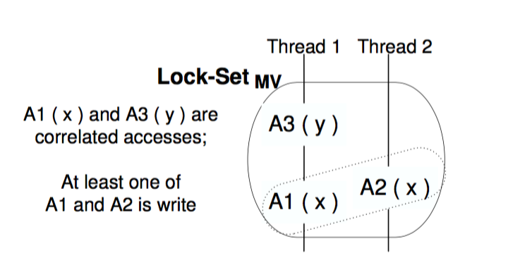

# 3.1.1 MUVI实现

MUVI的实现分为两个环节，首先需要发现代码中变量的关联关系，然后基于变量的关联关系，去发现（1）同时更新的bug（2）多变量的concurrency bugs。

## 3.1.1.1 变量关联性分析

在代码关联性分析中，需要进行两种关系的分析，一种是Access Together，一种是Access Correlation。Access Together是指用对变量的访问在源代码中的距离来衡量两次访问之间的关系。Access Correlation是指通过两次访问同时出现的概率来衡量两次访问之间的关系。

在最后的Correlation Generation阶段，MUVI会根据两个评价的标准来确定最后的访问的关联性，分别是Support和Confidence。

## 3.1.1.2 Bug Detection

在bug detection阶段，MUVI会根据通过关联性分析得到的结果，来分析两类Bug。

对于没有进行同步更新的Bug，最初的算法就是在结果中，对于Write(x) => AnyAcc(y)这样的关系，都去进行分析，找到代码中所有违背这样的关系的存在。所有违背这样的关系的函数，都会被列为同步更新Bug的候选集合。然后进行排序。这样的检测是可以被静态分析来实现的。

对于两个变量的数据竞争Bug，MUVI最主要的实现是扩展了目前的算法Lockset。因为MUVI所关注的变量访问的关联性是使用静态分析，而Lockset是使用动态分析来确定是否有数据竞争的问题的，因此需要使用代码动态翻译的技术来将MUVI对变量的关联性分析结合Lockset算法来进行执行。

<figure>
	
	<figcaption>MUVI扩展的Lockset算法</figcaption>
</figure>

如图所示，在原本的Lockset算法中，它保证同一个变量x的读和写被一个公共的锁所保护，而在MUVI的实现中，如果x与y之间有关联性，那也必须要有一个公共的锁来保护x和y。