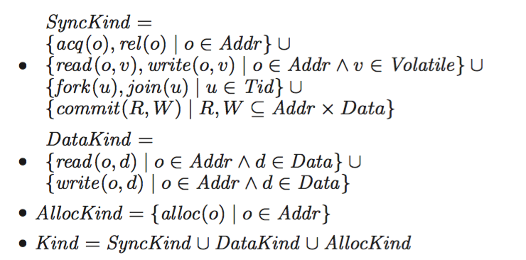
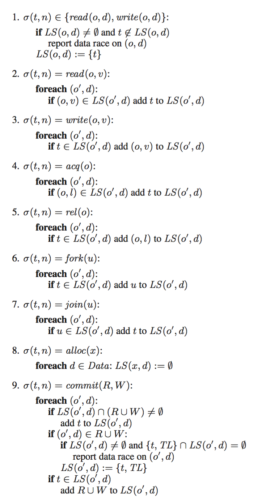

# Goldilocks

Java是目前而言最受欢迎的编程语言之一，在业界中，有越来越多的公司选择Java作为开发语言。Java是以共享内存作为其内存模型的语言[2]，因此也会遇到多线程环境下的数据竞争问题。Goldilocks[1]是在Java虚拟机上实现的，用于数据竞争动态检测的算法，它引入了一种新的运行时错误，被称为DataRaceException。每当程序中出现数据竞争的情况时，虚拟机就会抛出DataRaceException的异常，可以及时处理，以免问题继续扩散。而如果在执行过程中，没有任何的DataRaceException抛出，则可以认为在程序的执行流中没有数据竞争。

## 相关工作

Goldilocks是一个基于Eraser[3]提出的Lockset算法扩展而来的算法，Lockset算法的思想就是，在多线程程序中，一般程序员都会使用锁对临界区进行保护，临界区中一般都是共享变量的访问操作，如果一个共享变量在程序多线程执行过程中能够始终被一个或多个锁保护的话，那么在该共享变量上肯定不会发生数据竞争。反之，则有可能发生数据竞争。基于这样的观察，提出了Lockset的算法：

	Let locks held(t) be the set of locks held by thread t. 
	For each v, initialize C(v) to the set of all locks.
	On each access to v by thread t,
		set C(v) := C(v) Λ locks_held(t);
		if C(v) = { }, then issue a warning.

其思想非常简练，一共有两个阶段，第一个阶段为初始化阶段，对于每个线程t，都会维护一个locks_held(t)表明当前获得的锁集；对于每一个共享变量v，这个变量在初始化的时候获得程序执行过程中的所有可能锁集C(v)。之后是更新阶段，对于当前线程的每一次读写操作，都会更新当前被访问变量的候选集合C(v)。

Lockset算法是一种动态检测的算法，需要动态地对程序代码进行改写，用以统计读写、加锁释放锁、内存声明还有线程创建等操作。基于对这些操作的Trace，可以用Lockset得到会出现数据竞争的变量。

## Goldilocks实现

### 形式化描述

Goldilocks提出了一种形式化的描述方法，来对读写、加锁释放锁操作等等进行更好的描述与刻画。它将所有需要关注的操作抽象成了三种kind，分别是SyncKind，DataKind和AllocKind。对于每一种Kind，都是一些抽象操作的集合，这些集合在Goldilocks中被定义为：

<figure>
	
	<figcaption>形式化定义</figcaption>
</figure>

而关于Lockset的更新规则，也进行了相应的改变：

<figure>
	
	<figcaption>更新规则</figcaption>
</figure>

在这样的抽象下，使得Goldilocks对于事务，以及原子变量等等其他的同步操作有更好的支持。

### 不同实现方式的比较

因为Goldilocks是基于Lockset的，所以也是一种动态的检测方法。Goldilocks会监控Java字节码的运行，在这样的等级上，每一次变量的读写访问，或者是同步操作的指令，都是一条字节码的指令。同时每一个字节码的指令都会对应一个变量或者源码中的一行。

在已经发表的论文中，Goldilocks的实现有两个。在较早时间发表的论文中，Goldilocks是实现在Kaffe的运行时引擎的解释器模式下，Kaffe是一个使用C语言实现的Java虚拟机。这样实现的优势在于能够得到源代码在虚拟机内部，内存的布局，以及可以使用虚拟机内部实现的诸多算法。

除了上述方法，Flanagan和Freund在ROADRUNNER上也实现了Goldilocks算法，并发表了论文[4]。ROADRUNNER是一个动态分析工具，在这样的实现中，Goldilocks算法是通过在加载的时候，动态地插入Java字节码指令来实现的。

### 与Eraser的比较

之前的Lockset算法，是一种比较保守的算法，因此常常会在一些并没有数据竞争的情况下也会报出异常。举例来说明，在下面的实现中，Thread1中的对于data变量的初始化就会报出数据竞争的异常，因为没有任何一个锁保护该变量。
	
而在Goldilocks的实现中，对于数据竞争的检测是更加准确的。除此之外，Goldilocks的形式化抽象，使得它可以支持更多的同步方法。比如对于内存事务的方法进行同步的操作，以及volatile变量的读写等等。这些同步方法在传统的算法中都是没有支持的，而在Goldilocks就可以得以支持。

## reference

1. Elmas T, Qadeer S, Tasiran S. Goldilocks: a race and transaction-aware java runtime[C]//ACM SIGPLAN Notices. ACM, 2007, 42(6): 245-255.
2. Manson J, Pugh W, Adve S V. The Java memory model[M]. ACM, 2005.
3. Savage S, Burrows M, Nelson G, et al. Eraser: A dynamic data race detector for multithreaded programs[J]. ACM Transactions on Computer Systems (TOCS), 1997, 15(4): 391-411.
4. Flanagan C, Freund S N. The RoadRunner dynamic analysis framework for concurrent programs[C]//Proceedings of the 9th ACM SIGPLAN-SIGSOFT workshop on Program analysis for software tools and engineering. ACM, 2010: 1-8.