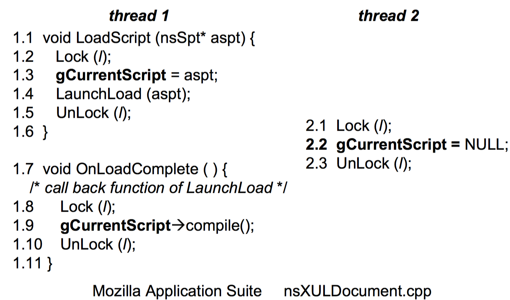
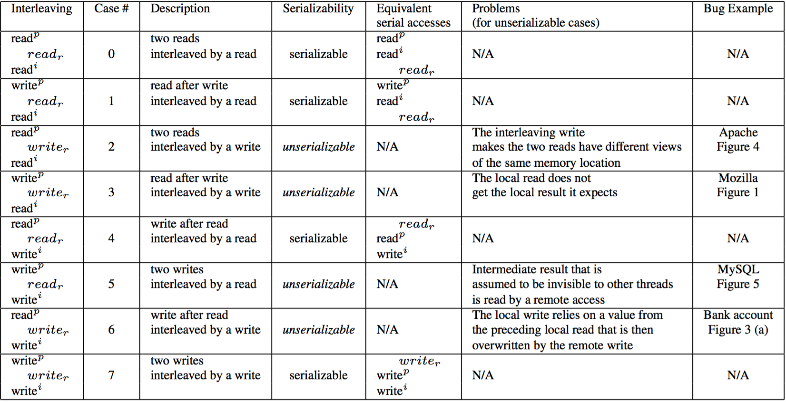

# AVIO

## 概述

在并发引起的Bug中，有一类Bug，被称为违反原子性的Bug。这一类Bug的特点在于难以定位，目前有很多并发Bug的检测都是基于数据竞争的，但是在保证Data Race Free的情况下，也有可能会出现违反原子性的Bug。为了解决这一类问题，AVIO采用了动态分析的方式，通过模式匹配的思想来定位具有特定特征的违反原子性的Bug。同时基于这样的想法，AVIO从软件层面和硬件层面各自进行了实现。并对两种实现各自的优劣进行了比较。

## 动机

一直以来，很多并发Bug检测的研究都专注于数据竞争。但是，Data Race Free并不代表是不存在并发问题的。

在上面的示例中，尽管所有对于变量gCurrentScript的访问都用同一把锁l进行了保护，但是，从语义来讲，OnLoadComplete函数是LaunchLoad函数的回调函数，从程序员的角度来讲，是希望保证LoadScript函数和OnLoadComplete函数中对于gCurrentScript变量的访问的原子性的。但是目前的绝大多数研究都没有关注这样的需求上。AVIO就是为了解决这样的问题而提出的一个系统。

## 实现

AVIO的实现中有两个流程，第一个是寻找程序员想要保证代码的原子性的代码片段，第二个是根据现存的模式，判断想要保证原子性的判断是否是安全的。

程序员想要保证代码的原子性的代码片段，可以被描述为"AI invariant。"如果在多次运行结果正确的代码执行路径中，访问同一个内存地址的操作总是按照特定的顺序被执行，那就将其视为是"AI invariant"。

在发现了这样的"AI invariant"后，需要对其进行模式匹配。其中一共有八种情况，如图所示。

其中在四种情况下，"AI invariant"是会被破坏的。举例说明，在第二种情况下，两条指令都是对一处内存的读操作，而在两条指令之间有了一条指令是对于同一处内存的写操作。在程序员看来，是想保证两处读到的值都是来自最近一次写的。而线程在执行中被交织了一条写操作，就破坏了原本的原子性的假设。因此就可能产生问题。AVIO就是通过这样的分析，来得到影响原子性的潜在代码。

## 分析

AVIO的核心思想十分简单，但同时也非常实用，可以检测出具有潜在Bug的代码。但是同时，AVIO也存在一些缺点。首先，AVIO是基于动态分析的，在寻找"AI invariant"时会将程序运行多次。根据文中语焉不详的描述，每次对于一个程序的运行基本都低于100次。但是这对于一个工具而言并不是很好地表现。其次，AVIO只能对单变量的情况进行分析，所以其在模式匹配时的状态机十分简单。如何对两个或更多的变量进行分析，还是一个值得讨论的话题。

// 应该添加与MUVI的对比，以及设想下如何用AVIO + MUVI进行多变量原子性Bug检测